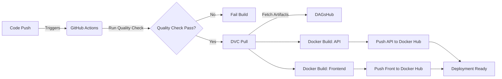

# Skin Disease Recognition

An end-to-end deep learning application for skin lesion classification, featuring a React frontend, FastAPI backend, and EfficientNet-based CNN model trained to recognize 22 dermatological conditions.

[](https://github.com/jarzeckil/skin-disease-recognition/actions/workflows/ci.yaml)
[](https://hub.docker.com/r/jarzeckil/skin-disease-api)

[](https://github.com/astral-sh/uv)
[](https://python.org)
[](#)
[](#)
[](#)
[](#)
[](#)
[](https://dvc.org/)
[](#)

---

## App is live

[Multi-container app](https://skin-disease-app.calmglacier-31f35a67.polandcentral.azurecontainerapps.io) hosted with Azure Container Apps.

(Revision scales down to 0, so it might take a minute for the service to load)

---

## Screenshots

| Prediction | Classification report with per-class metrics heatmap |
|:---:|:---:|
|  |  |


---

## Key Features

- **Multi-class Classification** - Recognizes 22 skin conditions including melanoma, eczema, psoriasis, and more
- **Real-time Predictions** - Upload images and get instant probability distributions
- **Model Performance Dashboard** - Interactive classification report with precision, recall, and F1 metrics per class
- **Export Reports** - Download analysis results as JSON
- **Dark/Light Theme** - Responsive UI with theme switching
- **Production-Ready** - Dockerized deployment with Nginx reverse proxy

---

## Model

I chose EfficientNet model family. Compared to traditional architectures like ResNet, it utilizes compound scaling, resulting in:
- Lower parameter count
- Higher efficiency
- Higher inference speed
- Reduced overfitting 

---

## Dataset

The model was trained on a [Kaggle dataset](https://www.kaggle.com/datasets/pacificrm/skindiseasedataset) consisting of 15,400+ clinical images.
- Data Distribution: The dataset is highly imbalanced (e.g., thousands of Acne samples vs. hundreds of Vasculitis). I mitigated this using WeightedRandomSampler in the training pipeline.
- Preprocessing: Images were resized to 300×300 pixels to match EfficientNet-B3 requirements.
- Augmentation: To improve generalization, I implemented a custom Albumentations pipeline including Flips, Rotate, Affine and ColorJitter (to simulate occlusions like hair or not centered photos).

---

## Tech Stack

### Machine Learning
| Technology | Purpose |
|------------|---------|
| **PyTorch** | Deep learning framework |
| **EfficientNet-B3** | CNN architecture (transfer learning from ImageNet) |
| **Albumentations** | Image augmentation pipeline |
| **MLflow** | Experiment tracking & model registry |
| **DVC** | Data & model version control |
| **Hydra** | Configuration management |

### Backend
| Technology | Purpose |
|------------|---------|
| **FastAPI** | REST API framework |
| **Uvicorn** | ASGI server |
| **Python 3.13** | Runtime |
| **uv** | Package manager (Astral) |

### DevOps
| Technology | Purpose |
|------------|---------|
| **Docker Compose** | Container orchestration |
| **Nginx** | Reverse proxy & static serving |
| **GitHub Actions** | CI/CD pipeline |
| **Azure Container Apps** | Deployment |
| **DAGsHub** | DVC remote storage |

### Frontend
| Technology | Purpose |
|------------|---------|
| **React 19** | UI library |
| **TypeScript** | Type safety |
| **Vite** | Build tool & dev server |
| **Tailwind CSS** | Styling |

---

## 🏗 CI/CD & Architecture

The pipeline automates the journey from code commit to production deployment.



---

## Model Performance

Current production model: **EfficientNet-B3 v4**

| Metric | Score |
|--------|-------|
| **Accuracy** | 80.6% |
| **Macro Precision** | 80.9% |
| **Macro Recall** | 80.0% |
| **Macro F1-Score** | 80.4% |

### Supported Conditions (22 classes)

<details>
<summary>View all classes</summary>

| Class | Class |
|-------|-------|
| Acne | Psoriasis |
| Actinic Keratosis | Rosacea |
| Benign Tumors | Seborrheic Keratoses |
| Bullous | Skin Cancer |
| Candidiasis | Sun/Sunlight Damage |
| Drug Eruption | Tinea |
| Eczema | Unknown/Normal |
| Infestations & Bites | Vascular Tumors |
| Lichen | Vasculitis |
| Lupus | Vitiligo |
| Moles | Warts |

</details>

---

## Project Structure

```
skin-disease-recognition/
├── src/skin_disease_recognition/
│   ├── core/           # Configuration & constants
│   ├── data/           # Dataset loaders & preprocessing
│   ├── modeling/       # Training engine & model definitions
│   ├── serving/        # FastAPI application
│   └── utils/          # Plotting, seeding, dataset download
├── frontend/
│   ├── src/
│   │   ├── components/ # React components
│   │   ├── hooks/      # Custom hooks (API state management)
│   │   ├── services/   # API client layer
│   │   ├── types/      # TypeScript interfaces
│   │   └── utils/      # Validation, export utilities
│   └── ...
├── conf/               # Hydra configuration files
├── models/             # Trained model artifacts (DVC-tracked)
├── data/               # Raw & processed datasets (DVC-tracked)
├── notebooks/          # Exploration & analysis notebooks
├── tests/              # Pytest test suite
├── .github/workflows/  # CI/CD pipeline
├── docker-compose.yaml # Production deployment
└── pyproject.toml      # Python dependencies & project config
```

---

## Getting Started

### Prerequisites

- Python 3.13+
- Node.js 20+
- [uv](https://github.com/astral-sh/uv) package manager
- Docker & Docker Compose (for deployment)

### Installation

```bash
# Clone repository
git clone https://github.com/jarzeckil/skin-disease-recognition.git
cd skin-disease-recognition

# Install Python dependencies
uv sync --all-groups

# Install frontend dependencies
cd frontend && npm install && cd ..

# Pull data and models from DVC
uv run dvc pull
```

### Development

```bash
# Terminal 1: Start backend
uv run uvicorn src.skin_disease_recognition.serving.app:app --reload --port 8000

# Terminal 2: Start frontend
cd frontend && npm run dev
```

Frontend will be available at `http://localhost:5173` with API proxy to backend.

### Production Deployment

```bash
# Build and run with Docker Compose
docker compose up --build -d
```

Application will be available at `http://localhost` (Nginx reverse proxy).

---

## API Endpoints

| Method | Endpoint | Description |
|--------|----------|-------------|
| `POST` | `/api/predict` | Upload image for classification |
| `GET` | `/api/info` | Get model name and version |
| `GET` | `/api/report` | Get full classification report |

---

## Lessons Learned

I faced several ML engineering challenges:

### Training Challenges

- **Loss Plateau** - Addressed with learning rate scheduling (ReduceLROnPlateau)
- **Transfer Learning** - Learned optimal learning rates for pretrained weights (lower LR for frozen layers)
- **Class Imbalance** - Implemented weighted random sampling to handle uneven class distribution
- **Regularization** - Applied label smoothing (0.1) to improve generalization and prevent overconfident predictions
- **Multi-class Metrics** - Understanding precision/recall/F1 trade-offs in 22-class classification

### Infrastructure & Tooling

- **VRAM Management** - Used gradient accumulation (virtual batches) to train larger models on limited GPU memory
- **MLflow Integration** - Centralized experiment tracking, metric logging, advanced evaluation and model versioning
- **Hydra Configuration** - Structured config management for reproducible experiments
- **DVC Pipelines** - Version control for datasets and model artifacts with DAGsHub remote

---

## Future Improvements

- [ ] Add confidence calibration (temperature scaling)
- [ ] Implement Grad-CAM visualizations for model interpretability
- [ ] Add batch prediction support

---

## License

This project is licensed under the MIT License - see the [LICENSE](LICENSE) file for details.

---

## Disclaimer
This application is for educational and research purposes only and should not be used as a substitute for professional medical advice, diagnosis, or treatment.
